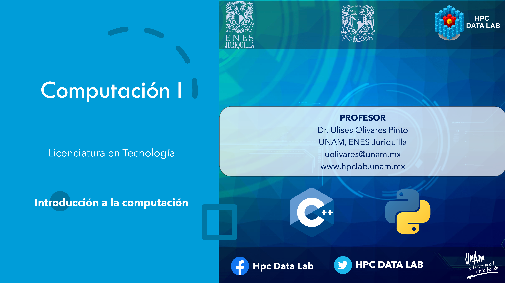

# Computación I

# Licenciatura en Tecnología

## Semestre 2022-1

## Profesor
Dr. Ulises Olivares Pinto

####  Profesor Invitado
 Lic. Walter André Rosales Reyes

## Objetivo
Dotar al estudiante de habilidades básicas de programación y capacidad de abstracción lógica para la solución de problemas utilizando el lenguaje de programación C++ y Python.

## Enlaces de interés

+ [Git](https://git-scm.com/downloads)
+ [GitHub](https://desktop.github.com/)
+ [Clion](https://www.jetbrains.com/clion/)
+ [Google Colab](https://colab.research.google.com/)
+ [Pycharm](https://www.jetbrains.com/pycharm/)

## Código en Clase

### GitHub
|Tema|Contenido| Recursos |
|--|--|--|
|1. GitHub |   Introducción, comandos básicos | <ul> <li>[Presentación](GitHub/GitGitHubPres.pdf) </li> <li> [Comandos básicos de git](https://git-scm.com/docs)</li> <li>[Conexión por SSH](https://docs.github.com/en/github/authenticating-to-github/connecting-to-github-with-ssh)</li> <li>[Guía Markdown](https://www.markdownguide.org/basic-syntax/)</li> <li> [Guía comandos BASH (Windows)](https://commandwindows.com/command3.htm)</li></ul> |

### Pseudocódigo
|Tema|Contenido| Código |
|--|--|--|
|1. Pseudocódigo |   Introducción, comandos básicos, operadores ralacionales, lógicos | <ul> <li>[Mayor de una lista, ](code/pseudocode/program1.cpp) </li> <li> [Número par, mayor de tres números, pertenencia](code/pseudocode/program2.cpp)</li> <li> [Serie de Fibonacci](code/pseudocode/Fibonacci.cpp)</li> </ul> |

### C++

|Tema|Contenido|Código Fuente|
|--|--|--|
|1. Variables y operadores aritméticos|<ol> <li> Operadores aritméticos</li> <li>Flujos de salida</li> <li>Evaluación de polinomios</li> </ol> |<ul>  <li> [Variables y operadores aritméticos](code/C++/arithmetic_operators.cpp) </li> </ul>|
|2. Operadores condicionales| <ol> <li>Operadores condicionales If ... else</li> <li>Flujos de entrada </li> <li>Ciclos for</li>  </ol>| <ul> <li> [Flujos de entrada (suma)](code/C++/sum_entrada.cpp) </li> <li>[Evaluación de polinomio (ciclo for)](code/C++/polynomial.cpp) </li> <li>[Operador condicional](code/C++/conditional.cpp) </li></ul>|
|3. Arreglos|Arreglos unidimensionale, paso de parámetros por referencia, funciones|<ul> <li>[Operaciones aritméticas con arreglos](code/C%2B%2B/arithmetic_functions.cpp)</li> </ul>|
|4. Matrices|Arreglos bidimensionales (Matrices), funciones, traza de una matriz| <ul> <li> [Traza de una matriz](code/C%2B%2B/trazaMat.cpp) </li><li> [Eliminación de Gauss](code/C%2B%2B/Gauss.cpp) </li> </ul>|
|5. Funciones|Funciones, suma de valores, paso de parámetros por valor|<ul> <li> [Suma Simple](code/C%2B%2B/funcionSum.cpp)</li> </ul>|
|6. Templates|Plantillas, funciones|<ul> <li> [Plantillas de funciones](code/C%2B%2B/plantillas.cpp) </li></ul>|
|7. Sobrecarga de funciones|Sobrecarga, funciones |<ul> <li> [Sobrecarga de funciones](code/C%2B%2B/sobrecarga_func.cpp) </li> </ul>|
|8. Clases y objetos|Clases, objetos, atributos, métodos |<ul> <li> [Área de Triángulo en un plano](code/C%2B%2B/POO/triangle_plane) </li> <li> [Área de Triángulo (estructuras)](code/C%2B%2B/POO/triangle_struct) </li><li>  </li></ul>|
|9. Vectores |POO, vectores |<ul> <li> </li> </ul>|
|10. Apuntadores |Punteros, paso de parámetros por referencia |<ul> <li> </li> </ul>|

### Python

|Tema|Contenido|Código Fuente|
|--|--|--|
|1. Introducción a Python| Variables, estructuras de datos, estructuras de control, |<ul> <li>  </li> </ul>|

# Prácticas

**Revisiones:** Puedes revisar los resultados y las calificaciones de tus prácticas en [el siguiente enlace](https://github.com/ulises1229/2022-1-Comp-I/tree/Grades).

|Práctica|Temas|Recursos|Fecha de entrega (antes de las 21:00 hrs)|
|--|--|--|--|
|1.Calculadora|<ol><li>Lenguaje C++</li><li>Instrucciones de control (condicionales)</li><li>Operadores aritméticos</li><li>Operadores lógicos</li><li>Estructuras de datos</li></ol>|<ul><li>[Práctica](practicas/3_Calculadora)</li></ul>|17/09/2021|
|2.Arreglos|<ol><li>Arreglos</li><li>Funciones</li></ol>|<ul><li>[Práctica](practicas/4_Arreglos)</li></ul>|24/09/2021|
|3.GaussJordan|<ol><li>Matrices</li><li>Templates</li><li>Funciones (paso de argumentos)</li></ol>|<ul><li>[Práctica](practicas/5_GaussJordan)</li></ul>|01/10/2021|
|4.Puntos y tansformaciones|<ol><li>Clases en C++</li><li>Archivos _.h_</li></ol>|<ul><li>[Práctica](practicas/6_Puntos)</li></ul>|15/10/2021|
|5.Carga Eléctrica|<ol><li>Programación orientada a objetos</li><li>Constructor y destructor en C++</li></ol>|<ul><li>[Práctica](practicas/7_CargaElectrica)</li><li>[Presentación](practicas/7_CargaElectrica/CargaElectricaPresentacion.pdf)</li><li></li></ul>|05/11/2021|
|6.Punto Isoeléctrico|<ol><li>Programación orientada a objetos</li><li>Vectores en C++</li></ol>|<ul><li></li><li></li><li></li></ul>||
|8.GaussJordanP|<ol><li>Lenguaje Python</li><li>Instrucciones de control (condicionales)</li><li>Operadores aritméticos</li><li>Operadores lógicos</li><li>Estructuras de datos</li></ol>|<ul><li>[Práctica](practicas/8_GaussJordanP)</li></ul>|19/11/2021|
|11.Auto|<ol><li>Programación orientada a objetos en Python</li></ol>|<ul><li></li><li></li></ul>||

#### Última modificación: 12 de noviembre de 2021