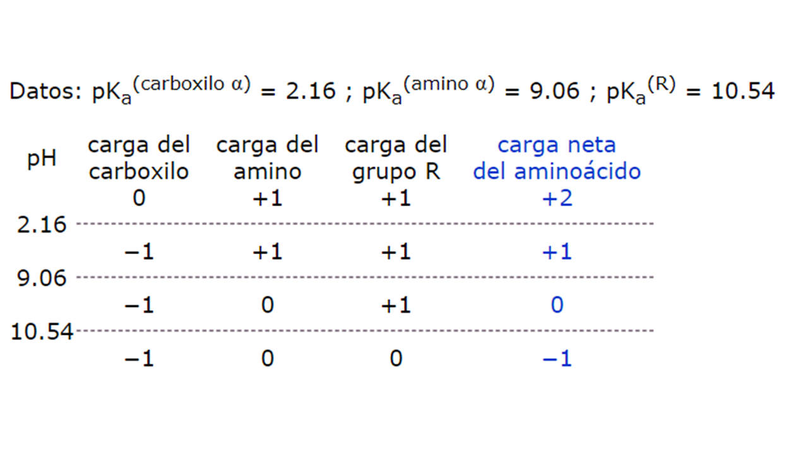

# Práctica 7: CargaElectrica

## Descripción

En esta práctica vamos a programar un proceso común en clases de bioquímica: el cálculo de la carga neta de una molécula (principalmente aminoácidos y/o péptidos) haciendo uso de la ecuación de Henderson–Hasselbalch. Puedes indagar un poco más en el tema en [Wikipedia (en inglés)](https://en.wikipedia.org/wiki/Henderson%E2%80%93Hasselbalch_equation) y en [Wikipedia (en español)](https://es.wikipedia.org/wiki/Ecuaci%C3%B3n_de_Henderson-Hasselbalch) ambos sitios son complementarios, no contienen la misma información, vale la pena revisar ambos. También puedes revisar [esta presentación](CargaElectricaPresentacion.pdf) que preparamos para tí.

Para llevar a cabo la práctica hemos puesto a tu disposición [este código](CargaElectrica.cpp) que contiene el esquema básico del funcionamiento de la práctica. En él, la función _main()_ realiza lo siguiente:
* Define el número de grupos `numGrupos` con los que va a contar la molécula.
* Solicita al usuario un nombre para la molécula
* Crea e inicializa un arreglo de variables del tipo `Grupo` de tamaño `numGrupos` que corresponde a los grupos de la molécula.
* Solicita al usuario información sobre cada uno de los grupos y los inicializa y asigna en el arreglo.
* Solicita al usuario el pH de la sustancia a la que se encuentra sometida la molécula.
* Evalúa la carga eléctrica neta de la molécula al pH indicado y lo imprime en pantalla.

Este código cuenta con tres funciones ya declaradas al inicio del archivo:

`PedirpH` la cual tiene como objetivo solicitar el valor de pH al cual se desea calcular la carga de la molécula y lo asigna a la variable `ph` pasada por referencia que corresponde a la variable `phMolecula` creada en el método `main()`. El prototipo de la función luce como: `void PedirpH(float& ph)`. Esta función **ya está totalmente implementada para tí**.

`CrearGrupo` es una función que recibe como parámetro un número entero que representa el grupo que se está pidiendo al usuario. El objetivo de esta función es solicitar al usuario información respecto al grupo tal como su nombre (e.g. _carboxilo_, _amino_, etc.), así como el valor de su respectivo _pKa_ y su carga eléctrica con un pH mayor a su pKa. Posteriormente crea una instancia de la clase `Grupo` pasando como argumentos al **constructor** el nombre, pKa y carga indicados por el usuario, regresando la nueva instancia creada. La declaración de la función es la siguiente: `Grupo CrearGrupo(int i)` donde `i` es el índice del grupo a llenar. Esta función **ya está totalmente implementada para tí**.

La siguiente función denominada `CalcularCargaApH` tiene como objetivo calcular la cargar eléctrica de la molécula a partir de la carga eléctrica de sus grupos a un cierto pH. Para lograrlo esta función recibe dos parámetros: un valor flotante `ph` pasado por referencia que corresponde al pH sobre el que se desea evaluar la carga de la molécula, el segundo parámetro es un _template_ denominado `grupos` el cual va a representar el arreglo de variables del tipo `Grupo` creado en `main()` denominado `todosGrupos`. La función completa luce de la siguiente forma:

```
template <typename grupos>
int CalcularCargaApH(float& ph, grupos todosGrupos)
{
    //TODO
}
```

Como podrás observar esta función	se encuentra vacía y es ahí donde vas a entrar en acción.

## Implementación

Para lograr tu práctica necesitarás implementar la función `CalcularCargaApH`, así como crear la clase `Grupo`, declarando la estructura en un archivo `Grupo.h` y la respectiva implementación de sus métodos en `Grupo.cpp`. Podrás crear tantos métodos y atributos como consideres necesarios en esta clase para lograr la implementación de la práctica.

Sin embargo, es **estrictamente necesario**, como podrás apreciar a partir del código en `CargaElectrica.cpp`, que ésta clase deberá de contar con un constructor, en particular uno que reciba tres parámetros _nombre_, _pka_ y _carga_ del grupo a crear **en ese orden**, de lo contrario no funcinará tu implementación con el código que ya te brindamos. Toma en cuenta también que únicamente deberás de modificar la implementación de la función `CalcularCargaApH` dentro del código `CargaElectrica.cpp`, no podrás modificar ninguna sección ya implementada ni ninguna función; pero eso no te limita a crear nuevas funciones, **no nuevas variables en funciones ya implementadas ni tampoco en la función main**.

#### NOTA A CONSIDERAR
Para que tu práctica funcione de manera correcta vas a necesitar tener tres archivos, los ya mencionados `Grupo.h` y `Grupo.cpp` que es donde vas a implementar la declaración de la clase `Grupo` y la implementación de sus métodos repectivamente. El tercer archivo será el que te brindamos `CargaElectrica.cpp` en el cual se tiene toda la estructura del proyecto. Estos tres archivos tendrán que encontrarse en tu carpeta `CargaElectrica`, de lo contrario podría haber problemas con la revisión de tu práctica.

### Ejemplo de funcionamiento
A continuación se muestra un ejemplo del funcionamiento esperado de tu práctica.

```
$ ./ CargaElectrica

Nombre de la molecula: Lisina
Nombre grupo 0: Carboxilo
pK del grupo Carboxilo: 2.16
Carga del grupo Carboxilo a pH mayor a 2.16: -1
Nombre grupo 1: Amino
pK del grupo Amino: 9.06
Carga del grupo Amino a pH mayor a 9.06: 0
Nombre grupo 2: R
pK del grupo R: 10.54
Carga del grupo R a pH mayor a 10.54: 0
pH de la solucion (buffer): 8.4
Carga de la molecula = 1

```

Este problema deriva de los resultados del siguiente ejemplo:


